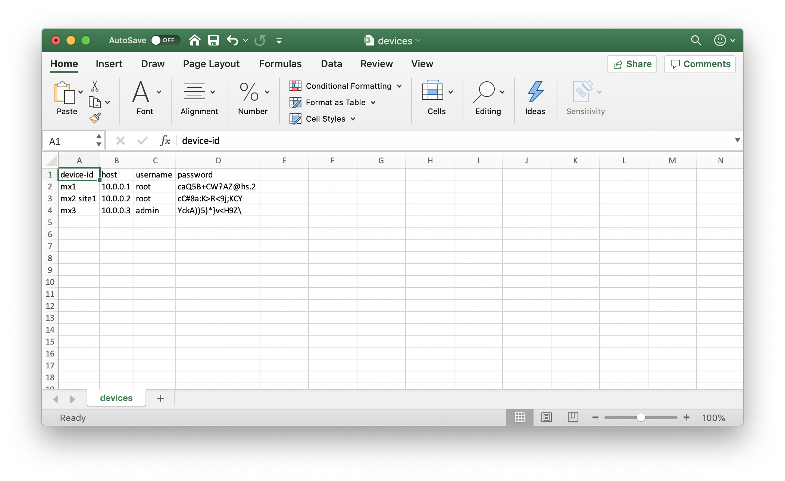
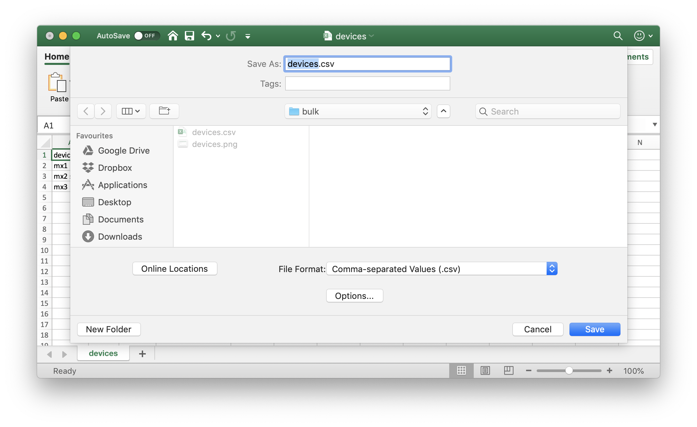
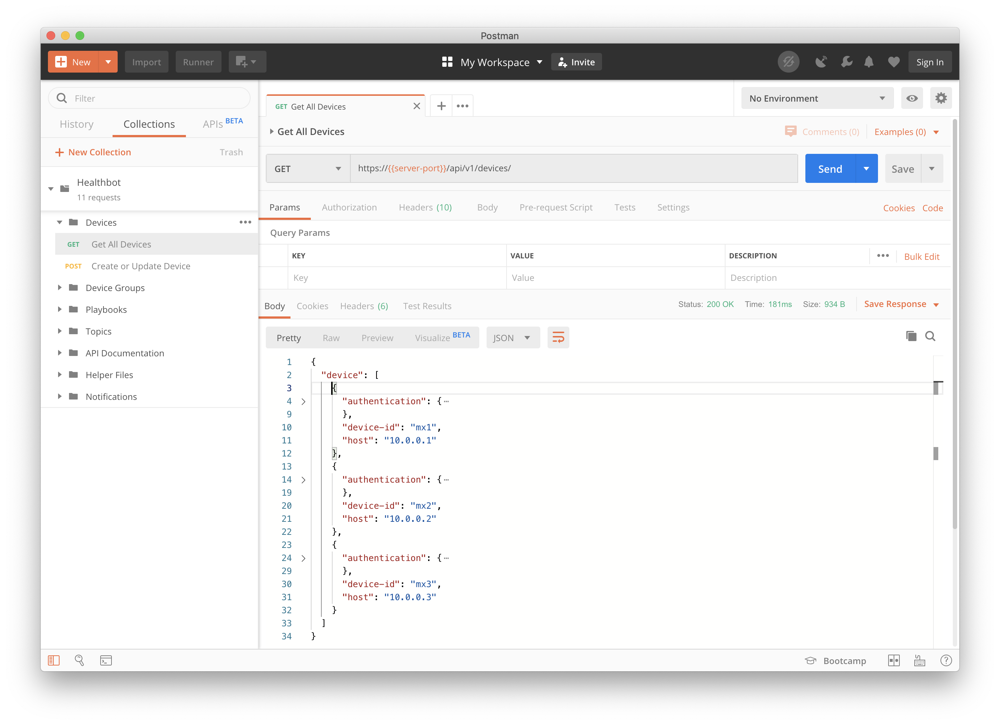

This guide describes using a tool to Bulk Provision a Healthbot Installation. The tools aim is to simplify the initial setup of a Healthbot installation by minimising the repetitive tasks when onboarding Devices or aggregating Devices into Groups.

## h7t

h7t is a command-line tool publicly available at this Github repository [https://github.com/damianoneill/h7t](https://github.com/damianoneill/h7t). The tool has releases for Windows, OSX or Linux x86 64bit binaries. It is versioned, the latest version can be downloaded from the [releases](https://github.com/damianoneill/h7t/releases/latest) page. Expand the tar.gz into a directory where you want to store the command-line tool.

```console
$ tree .
.
├── LICENSE
├── README.md
├── h7t
└── plugins
    └── csv
        └── transformer

2 directories, 4 files
```

The tool is self-documenting, the commands (and sub-commands) description and options can be viewed by passing the help (-h) flag.

```console
$ h7t -h
A tool for interacting with Healthbot over the REST API.

The intent with this tool is to provide bulk or aggregate functions, that simplifies interacting with Healthbot.

Usage:
  h7t [command]

Available Commands:
  completion  Generate shell completion script for h7t
  configure   Configure information relating to a Healthbot Installation
  docs        Generate Markdown for the commands in h7t
  extract     Extract information from a Healthbot Installation
  help        Help about any command
  load        Load information into a Healthbot Installation
  summarise   Summarise information from a Healthbot Installation
  transform   Transform things from proprietary formats into Healthbot dsl format
  version     Output the current build information

Flags:
  -a, --authority string   healthbot HTTPS Authority (default "localhost:8080")
      --config string      config file (default is $HOME/.h7t.yaml)
  -h, --help               help for h7t
  -p, --password string    healthbot Password (default "****")
  -u, --username string    healthbot Username (default "admin")
  -v, --verbose            cause h7t to be more verbose

Use "h7t [command] --help" for more information about a command.
```

> The tool can generate a bash completion script, see the completion sub-commands' help for instructions.

You can see some top-level flags are used to identify the Healthbot installation that you are working against, specifically;

- authority, the hostname and port of the healthbot server
- username, used to login to healthbot
- password, used for the login

To minimise the amount of typing required with the tool, a configuration can be defined for these values as follows;

```console
$ cat ~/.h7t.yaml
---
authority: "my-hb-server:8080"
username: root
password: ardma73x~-;
```

This will be used unless values are overridden directly on the command line.

## Extract Transform Load (ETL)

In computing, extract, transform, load (ETL) is the general procedure of copying data from one or more sources into a destination system which represents the data differently from the source(s) or in a different context than the source(s).

Data extraction involves extracting data from homogeneous or heterogeneous sources; data transformation processes data by data cleansing and transforming them into a proper storage format/structure for the purposes of querying and analysis; finally, data loading describes the insertion of data into the final target database.

With h7t, we use the term ETL as it is well understood. In the context of Healthbot a precise definition is described below;

- Extract information from an existing Healthbot installation e.g. extracting the Device configurations and storing them locally in a format that can be used against the same or other Healthbot installations.
- Transform information in one format for e.g. Device details stored in a CSV file into a format that can be consumed by this tool.
- Load configuration from files e.g. a set of Device Group definitions and apply these against a Healthbot installation.

The key objective with the tool is to minimize the laborious configuration required in large networks. Other uses cases exist; e.g. cloning the production deployment into a lab system for regression testing of new releases, staging system setup for new configurations or loads, etc.

## Sample Scenario

To solidify your understanding of the tool, I will demonstrate a use case below.

A Healthbot users has an Excel spreadsheet containing a list of Devices; their management IP address, username and passwords for connecting to them.



We can export this spreadsheet into a CSV file and use this as input to the tool to generate a configuration for provisioning this set of Devices within a Healthbot installation.



The [file](assets/devices.csv) will be in text format and will look like the following;

```console
$ cat devices.csv
device-id,host,username,password
mx1,10.0.0.1,root,caQ5B+CW?AZ@hs.2
mx2,10.0.0.2,root,cC#8a:K>R<9j;KCY
mx3,10.0.0.3,admin,YckA))5)*}v<H9Z\
```

At this point, there is no way for Healthbot to consume this information, we need to transform this into a format that can be sent to an installation. We do this using the transform sub-command within h7t.

```console
$ h7t transform -h
Transform customer content into dsl things e.g. devices.

Transform sub-commands work by iterating over all files in the input directory

Usage:
  h7t transform [flags]
  h7t transform [command]

Available Commands:
  devices     Transform Devices configuration

Flags:
  -h, --help                      help for transform
  -i, --input_directory string    directory where the configuration will be loaded from (default ".")
  -o, --output_directory string   directory where the configuration will be written to (default ".")
      --plugin string             name of the plugin to be used (default "csv")

Global Flags:
  -a, --authority string   healthbot HTTPS Authority (default "localhost:8080")
      --config string      config file (default is $HOME/.h7t.yaml)
  -p, --password string    healthbot Password (default "****")
  -u, --username string    healthbot Username (default "admin")
  -v, --verbose            cause h7t to be more verbose

Use "h7t transform [command] --help" for more information about a command.
```

You can see from the output above that transform is a parent command and that it contains a sub-command devices.

> It is assumed that customers' data may exist in multiple formats, therefore; transform devices is implemented using a plugin technology that allows developers to create plugins for h7t for implementing custom transform logic. Further information on this is available on the [transform readme](https://github.com/damianoneill/h7t/tree/master/plugins).

By default, the CSV plugin (sample plugin that is shipped as a separate binary with the tool) will be used. This plugin needs to be stored in a plugins directory relative to where the h7t binary has been saved.

```console
$ ./h7t transform devices -i ./customer-devices/ -o ./healthbot-devices/
Using config file: /Users/doneill/.h7t.yaml
Plugin: csv
Wrote 3 Things to ./healthbot-devices//devices.yml
```

> To simplify the invocation of the tool, all commands that use configuration files (except configure devices) take a directory as arguments, the tool will attempt to load all files within the directory, allowing users to partition how they store configuration in a manner that suits their business needs.

Running this command will generate a YAML file. This file can be used (for example) as input to the tool for provisioning Devices within Healthbot.

```console
$ cat ./healthbot-devices/devices.yml
device:
- device-id: mx1
  host: 10.0.0.1
  authentication:
    password:
      username: root
      password: caQ5B+CW?AZ@hs.2
- device-id: mx2
  host: 10.0.0.2
  authentication:
    password:
      username: root
      password: cC#8a:K>R<9j;KCY
- device-id: mx3
  host: 10.0.0.3
  authentication:
    password:
      username: admin
      password: YckA))5)*}v<H9Z\
```

The format of the YAML file is dictated by the format of the JSON payloads used in the REST requests that can be sent to the Healthbot installation. Examples of the various REST requests are covered in the [REST API](rest-api#first-request) Guide. YAML was chosen as the default configuration as it is more easily read by humans than JSON. The tool will automatically convert between YAML and JSON, however, JSON payloads can be used as input if preferred. A complete YAML example of the options in the Devices configuration is available in the [testdata folder](https://github.com/damianoneill/h7t/tree/master/dsl/testdata).

At this point, we have a valid Devices configuration that can be used against a Healthbot installation to bulk provision the Devices. To do this, we run the load command.

```console
12:26 $ h7t load devices -i ./healthbot-devices/
Using config file: /Users/doneill/.h7t.yaml
Updated 3 Things from healthbot-devices/devices.yml to my-hb-server:8080
```

We can use the [Postman Request](rest-api#postman) (Get all Devices) to confirm that this was successful.



The load command also provides sub-commands for

- Device Groups
- Helper Files

More information on these are available in the [docs folder](https://github.com/damianoneill/h7t/blob/master/docs/h7t_load.md).

## Other notable commands

There are a few other commands that are worth pointing out.

```console
$ h7t summarise installation
Using config file: /Users/doneill/.h7t.yaml

Healthbot Authority: podrunner:8080
Healthbot Version: HealthBot 2.1.0-beta
Healthbot Time: 2019-11-14T12:38:35Z

No of Managed Devices: 3

  Device Id  Platform  Release  Serial Number

  mx1       MX240     18.1      JN1261DB3AFC
  mx2       MX480     18.4R2.7  JN1264DB3AFD
  mx3       MX240     18.4R2.7  JN1364DB3BFA

No of Device Groups: 1

  Device Group  No of Devices
  dg1                       2

```

The configure command provides a Devices sub-command for provisioning Devices using NETCONF RPC Requests. This can be used to bulk provision configuration directly on the Devices, e.g. configuring the entablement of gRPC for Telemetry.

```console
$ cat grpc.rpc
<edit-config>
  <target>
    <running/>
  </target>
  <config>
    <system>
      <services>
        <extension-service>
          <request-response>
            <grpc>
              <clear-text/>
              <skip-authentication/>
            </grpc>
          </request-response>
        </extension-service>
      </services>
    </system>
  </config>
</edit-config>

$ h7t configure devices -i ./healthbot-devices/ -f grpc.rpc
```

Finally, all load commands take a -e option to erase rather than create the Things defined in the configuration files. E.g. to delete the Devices provisioned in Healthbot above, you could run the following:

```console
h7t load devices -i ./healthbot-devices/ -e
```

This (in conjunction with Device Groups sub-command) can be used as a quick solution to blanking a Healthbot installation.
