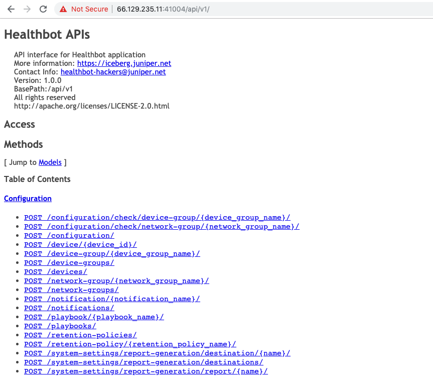
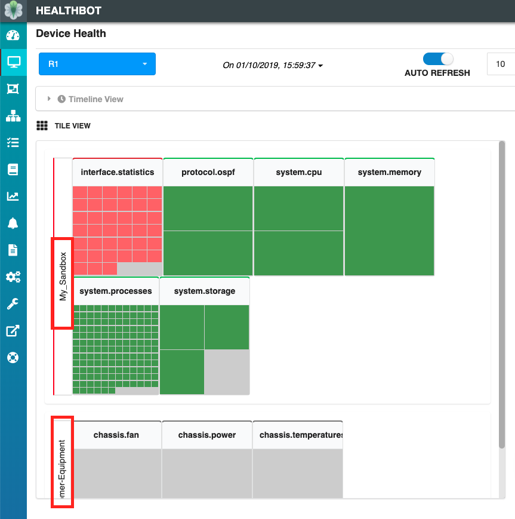

The Device Health page provides a solution to detect and troubleshoot Device Level health problems. It provides **visual indicators** (traffic-light colours) to see whether an issue exists or not.


The page has three panes; Timeline View (Time), Tile View (Summary) and Table View (Detail) panes. Each pane provides a window into each of the stages for Health resolution.


The sections below describe these panes and how they can be interpreted.

## Timeline View

Healthbot aggregates network data, it can be used to predict failures or correlate historical events against network activity. To facilitate the historical component, this health page provides a timeline slider that enables the user to select a period for which network data has been collected.

The timeline allows you to select your time period by scrolling left or right and then double-clicking in the pane to determine the start (and finish) window.

The dash and line shown on the screenshot indicated either a minor (yellow) or major (red) trigger has occurred within this given time period, this allows the user through a visual indicator to narrow in on the time period of interest.


The red box on the left-hand side of the screenshot identifies a Key Performance Indicator (KPI). KPIs in Healthbot are created by defining triggers against data (sensor information).

In this example the rule **check-system-cpu-load-average** in the topic **system.cpu** has a trigger (KPI) defined called **cpu-utilization-15min** that on a **60 second** frequency determines whether 15 minute CPU Utilization is normal or abnormal. You can see the KPI definition in the below screenshot.


For a full list of the KPIs available on your system you can make a [curl](https://curl.haxx.se/) query against the REST API shipped with Healthbot and use [jq](https://stedolan.github.io/jq/) to filter the response.

```sh
curl -s -X GET "https://<server:port>/api/v1/topics/" -H "accept: application/json" -H "Content-Type: application/json" -u <username:password> --insecure | jq '.topic[].rule[].trigger[]? | {name: .["trigger-name"], description: .description}'
```

Will return a list of json objects with the KPI name and a description of the KPI.

```
{
  "name": "re-memory-buffer-utilization",
  "description": "Sets health based on increase in system memory buffer utilization"
}
{
  "name": "processes-cpu-utilization",
  "description": "Sets health based on system processes cpu utilization"
}
{
  "name": "processes-memory-utilization",
  "description": "Sets health based on system processes memory utilization"
}
{
  "name": "cpu-utilization-15min",
  "description": "Sets health based on increase in RE CPU 15 minutes load average utilization"
}
{
  "name": "cpu-utilization-1min",
  "description": "Sets health based on increase in RE CPU 1 minute load average utilization"
}

...

```

Each instance of Healthbot includes full documentation of the available REST APIs, this can be viewed at **https://<server:port>/api/v1/**



## Tile View

The Tile View provides a Device Group led summary of the Health of a Device. As we know Playbooks are instantiated against Device Groups and KPIs are a component of the Rules within a Playbook. So the summary visualized in this pane groups visual indicators for KPIs by [Topic](glossary#topic) and by Device Groups.

- Playbook -> Rules -> Triggers (KPIs)
- Device Group -> Devices
- Playbook Instances -> Device Groups

For Devices that are defined in multiple Device Groups, each Device Group that a Device participates within will be visible as a collection in this view, with Device Groups scrolling vertically over this view.



The Device Group name will be visible on the left side of this pane for each of the groupings. This can be confirmed again with an API call, note below the call is filtering based on the Device name, in this case "R1".

```sh
curl -s -X GET "https://<server:port>/api/v1/device-groups/" -H "accept: application/json" -H "Content-Type: application/json" -u <username:password> --insecure | jq '."device-group"[] | select(.devices | index("R1")) | ."device-group-name"'
```

Which will return a list of Device Group names if Device "R1" is present within that Device Group.

```
"My_Sandbox"
"Customer-Equipment"
```

## Table View

When a specific Tile is identified for further investigation, selecting it will result on a filter being applied to the Table view’s columns Topic and Keys. The Topic filter matches on the Topic name. The Keys filter is a composite of a number of different variables.


In the example above the Key is constructed as follows;

- Playbook Instance Name
- Playbook Name
- Set of Key Fields configured in the rule for this Playbook

Therefore for

```
_instance_id: ["interface-kpi-sandbox"], _playbook_name: interface-kpis-playbook, interface-name: pfe-0/0/0
```

The Instance Name is interface-kpi-sandbox, the Playbook name is interface-kpis-playbook and the key field in this Playbooks rule is the interface name, in my case I selected the tile for pfe-0/0/0.

As you can see, from the screenshot the KPIs that match this filter (at this time) are shown.

Again, as before this can be confirmed with an API call.

```sh
curl -s -X GET "https://<server:port>/api/v1/health-tree/R1/" -H "accept: application/json" -H "Content-Type: application/json" -u <username:password> --insecure | jq '.children[].children[].children[].children[] | select (.color=="red") | select(.data | contains("pfe-0/0/0")) | .data'
```

In this case, this will return the Major messages filtered for the pfe-0/0/0 interface.

```
"pfe-0/0/0 output traffic is above high threshold(8e+08 octets)"
"Out errors are increasing continuously on pfe-0/0/0, Error count is:0"
"pfe-0/0/0 input traffic is above high threshold(8e+08 octets)"
"In errors are increasing continuously on pfe-0/0/0, Error count is:0"
```

In this case the API is filtering based on a match in the message content, but a number of additional criteria are returned in this API call and could be used to further match on the content.
