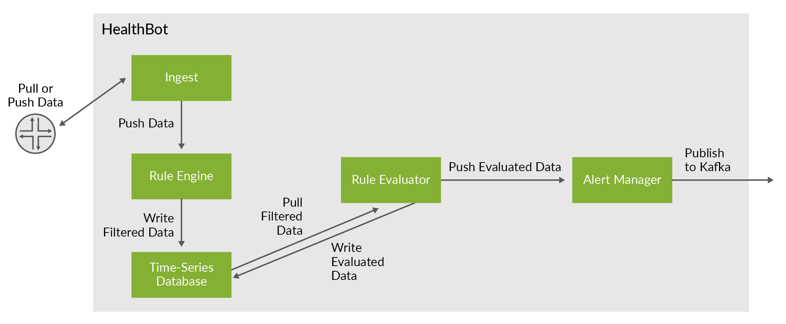

This guide describes how Healthbot can be integrated with [Apache Kafka](https://kafka.apache.org/), is a distributed messaging system providing fast, highly scalable and redundant messaging through a pub-sub model.

> Before working through this guide, please ensure you have a good overview of what Kafka is and how it works. A fantastic summary is available in this youtube video - [Apache Kafka Explained](https://www.youtube.com/watch?v=JalUUBKdcA0). Additional information can be found in [Kevin Sookocheff article](https://sookocheff.com/post/kafka/kafka-in-a-nutshell/).

## Egest

In addition to the Slack and Webhook notification delivery methods, HealthBot provides an option to publish notifications to a Kafka cluster. This is the primary focus of this guide.



To configured Healthbot to publish notifications to Kafka there are a few Kafka concepts that we need to understand.

The basic architecture of Kafka is organized around a few key terms: topics, producers, consumers, and brokers.

All Kafka messages are organized into **topics**. If you wish to send a message you send it to a specific topic and if you wish to read a message you read it from a specific topic. A consumer pulls messages off of a Kafka topic while **producers** push messages into a Kafka topic. Lastly, Kafka, as a distributed system, runs in a cluster. Each node in the cluster is called a **Kafka broker**.

In the context of Kafka, Healthbot Egest is a **producer**, we will provision the **topic** to push Healthbot Notifications, as well as the Address and Port of the **broker** that will receive the Notifications.

To demonstrate Kafka Egest we need a Kafka deployment, for those that don't have an existing deployment, we will use [Docker Compose](https://docs.docker.com/compose/) to scaffold one for our testing. Compose is a tool for defining and running multi-container Docker applications. With Compose, you use a YAML file to configure your application’s services. Then, with a single command, you create and start all the services from your configuration. Instructions are available for [installing Docker Compose](https://docs.docker.com/compose/install/).

> Ensure that the host you use for running this is bi-directional routable to your host running Healthbot, if this is not possible consider running this test environment on your Healthbot server.

This guide includes a docker-compose.yml file that can be used to set up your test environment. As a one time step, download this file to your local machine.

```sh
wget https://damianoneill.github.io/healthbot/docs/assets/kafka/docker-compose.yml
```

Then you can start your test environment as follows, note you need to specify the IP address/dns name of your Healthbot server in the environment variable HEALTHBOT_SERVER as well as the public ip address of the host (could also be the Healthbot Server) where you are running the docker-compose file. Healthbot uses Influx as its time series database, in this guide we will use chronograf to view the contents of the database and to correlate its contents with notifications that get sent to our Kafka Topic, running docker-compose up will start a chronograph instance locally pointing to Healthbot Server environment variable making the UI available on [http://localhost:8888](http://localhost:8888/).

```sh
export HEALTHBOT_SERVER=foyle.jnpr.belfast
export KAFKA_OUTSIDE=foyle.jnpr.belfast
```

After defining your environment startup the containers (chronograph, kafka, zookeeper) as follows:

```sh
docker-compose up
```

If this was successful, you should see output similar to below:

```sh
Starting chronograf ... done
Attaching to chronograf
...
chronograf    | time="2019-10-21T10:34:16Z" level=info msg="Response: OK" component=server method=GET remote_addr="172.20.0.1:32796" response_time="35.1µs" status=200
chronograf    | time="2019-10-21T10:34:27Z" level=info msg="Response: OK" component=server method=GET remote_addr="172.20.0.1:32796" response_time="53.2µs" status=200
chronograf    | time="2019-10-21T10:34:38Z" level=info msg="Response: OK" component=server method=GET remote_addr="172.20.0.1:32796" response_time="29.6µs" status=200
chronograf    | time="2019-10-21T10:34:49Z" level=info msg="Response: OK" component=server method=GET remote_addr="172.20.0.1:32796" response_time="27.3µs" status=200
```

We can confirm that Kafka started correctly using [nc](https://linux.die.net/man/1/nc).

```sh
$ nc -vz foyle.jnpr.belfast 9094
found 0 associations
found 1 connections:
     1:	flags=82<CONNECTED,PREFERRED>
	outif en0
	src 172.26.137.194 port 63606
	dst 172.26.138.139 port 9094
	rank info not available
	TCP aux info available

Connection to foyle.jnpr.belfast port 9094 [tcp/*] succeeded!
```

And that a **test** topic was created as part of the initialisation using the kafka-topics.sh script bundled with kafka:

```sh
$ docker run -it --network=host edenhill/kafkacat:1.5.0 -b  foyle.jnpr.belfast:9094 -L
Metadata for all topics (from broker 1001: foyle.jnpr.belfast:9094/1001):
 1 brokers:
  broker 1001 at foyle.jnpr.belfast:9094 (controller)
 1 topics:
  topic "test" with 1 partitions:
    partition 0, leader 1001, replicas: 1001, isrs: 1001
```

Kafka itself uses Zookeeper to maintain cluster details. Apache Zookeeper is a distributed, open-source configuration, synchronization service along with naming registry for distributed applications like Kakfa. We can use [zk-shell](https://github.com/rgs1/zk_shell) a shell for Zookeeper to query the Kafka broker configuration.

```sh
$ zk-shell foyle.jnpr.belfast:2181
Welcome to zk-shell (1.2.5)
(DISCONNECTED) />
(CONNECTED [foyle.jnpr.belfast:2181]) /> get brokers/ids/1001
{"listener_security_protocol_map":{"INSIDE":"PLAINTEXT","OUTSIDE":"PLAINTEXT"},"endpoints":["INSIDE://cb87849a165a:9092","OUTSIDE://foyle.jnpr.belfast:9094"],"jmx_port":-1,"host":"cb87849a165a","timestamp":"1571673614423","port":9092,"version":4}
(CONNECTED [foyle.jnpr.belfast:2181]) />
```

Listen to Topic test

```sh
docker run -it --network=host edenhill/kafkacat:1.5.0 -b  foyle.jnpr.belfast:9094 -t test
```

## Ingest

Kafka Ingest is currently not support in 2.0.2. Kafka Ingest is in active development and will be available in an upcoming release.
