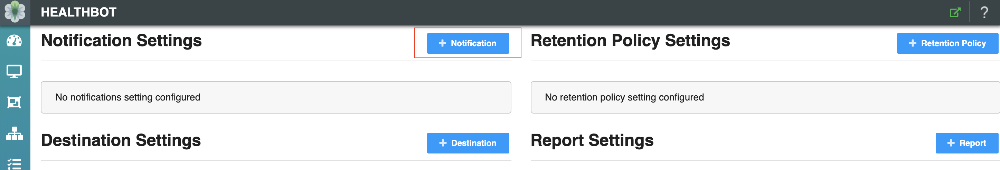

This guide describes how Healthbot can be integrated with [Apache Kafka](https://kafka.apache.org/), is a distributed messaging system providing fast, highly scalable and redundant messaging through a pub-sub model.

> Before working through this guide, please ensure you have a good overview of what Kafka is and how it works. A fantastic summary is available in this youtube video - [Apache Kafka Explained](https://www.youtube.com/watch?v=JalUUBKdcA0). Additional information can be found in [Kevin Sookocheff article](https://sookocheff.com/post/kafka/kafka-in-a-nutshell/).

## Egest

In addition to the Slack and Webhook notification delivery methods, HealthBot provides an option to publish notifications to a Kafka cluster. This is the primary focus of this guide.


To configure Healthbot to publish notifications to Kafka there are a few Kafka concepts that we need to understand.

### Kafka overview

The basic architecture of Kafka is organized around a few key terms: topics, producers, consumers, and brokers.


- Credit https://blog.parse.ly/post/3886/pykafka-now/

All Kafka messages are organized into **topics**. If you wish to send a message you send it to a specific topic and if you wish to read a message you read it from a specific topic. A consumer pulls messages off of a Kafka topic while **producers** push messages into a Kafka topic. Lastly, Kafka, as a distributed system, runs in a cluster. Each node in the cluster is called a **Kafka broker**.

In the context of Kafka, Healthbot Egest is a **producer**, we will provision the **topic** to push Healthbot Notifications, as well as the Address and Port of the **broker** that will receive the Notifications.

### Demo Environment

To demonstrate Kafka Egest we need a Kafka deployment, for those that don't have an existing deployment, we will use [Docker Compose](https://docs.docker.com/compose/) to scaffold one for our purposes. Compose is a tool for defining and running multi-container Docker applications. With Compose, you use a YAML file to configure your application’s services. Then, with a single command, you create and start all the services from your configuration. Instructions are available here for [installing Docker Compose](https://docs.docker.com/compose/install/).

> Ensure that the host you use for running this demo is bi-directionally routable to your host running Healthbot, do **not** run this on your Healthbot host as the out of the box Docker routing will not work correctly.

This guide includes a docker-compose.yml file that can be used to set up your test environment. As a one time step, download this file to your local machine that will host Kafka for e.g. your laptop.

```sh
wget https://damianoneill.github.io/healthbot/docs/assets/kafka/docker-compose.yml
```

Then you can start your test environment as follows, note you need to specify the public address of the host where you are running the docker-compose file, I suggest using IP Addresses to ensure no DNS resolution issues.

```sh
export KAFKA_OUTSIDE=172.26.138.101
```

After defining your environment, startup the containers (kafka, zookeeper) as follows:

```sh
docker-compose up
```

If this was successful, you should see output similar to below:

```sh
kafka        | waiting for kafka to be ready
zookeeper    | ZooKeeper JMX enabled by default
zookeeper    | Using config: /opt/zookeeper-3.4.13/bin/../conf/zoo.cfg
kafka        | [Configuring] 'inter.broker.listener.name' in '/opt/kafka/config/server.properties'
kafka        | Excluding KAFKA_HOME from broker config
kafka        | [Configuring] 'port' in '/opt/kafka/config/server.properties'
kafka        | [Configuring] 'advertised.listeners' in '/opt/kafka/config/server.properties'
kafka        | [Configuring] 'listener.security.protocol.map' in '/opt/kafka/config/server.properties'
kafka        | [Configuring] 'broker.id' in '/opt/kafka/config/server.properties'
kafka        | Excluding KAFKA_VERSION from broker config
kafka        | [Configuring] 'listeners' in '/opt/kafka/config/server.properties'
kafka        | [Configuring] 'zookeeper.connect' in '/opt/kafka/config/server.properties'
kafka        | [Configuring] 'log.dirs' in '/opt/kafka/config/server.properties'
zookeeper    | 2019-10-22 12:48:33,390 [myid:] - INFO  [main:QuorumPeerConfig@136] - Reading configuration from: /opt/zookeeper-3.4.13/bin/../conf/zoo.cfg
zookeeper    | 2019-10-22 12:48:33,393 [myid:] - INFO  [main:DatadirCleanupManager@78] - autopurge.snapRetainCount set to 3
zookeeper    | 2019-10-22 12:48:33,393 [myid:] - INFO  [main:DatadirCleanupManager@79] - autopurge.purgeInterval set to 1
...
```

We can confirm that Kafka started correctly using [nc](https://linux.die.net/man/1/nc) against port 9094 (Kafka OUTSIDE port) on your Kafka demo box.

```sh
$ nc -vz 172.26.138.101 9094
found 0 associations
found 1 connections:
     1:	flags=82<CONNECTED,PREFERRED>
	outif en0
	src 172.26.137.194 port 63606
	dst 172.26.138.101 port 9094
	rank info not available
	TCP aux info available

Connection to 172.26.138.101 port 9094 [tcp/*] succeeded!
```

And that a **test** topic was created as part of the initialisation on startup:

```sh
$ docker run -it --network=host edenhill/kafkacat:1.5.0 -b  172.26.138.101:9094 -L
Metadata for all topics (from broker 1001: 172.26.138.101:9094/1001):
 1 brokers:
  broker 1001 at 172.26.138.101:9094 (controller)
 1 topics:
  topic "test" with 1 partitions:
    partition 0, leader 1001, replicas: 1001, isrs: 1001
```

Kafka itself uses Zookeeper to maintain cluster details. Apache Zookeeper is a distributed, open-source configuration, synchronization service along with naming registry for distributed applications like Kakfa. We can use [zk-shell](https://github.com/rgs1/zk_shell) a shell for Zookeeper to query the Kafka broker configuration.

```sh
$ docker run --rm -it wbowling/zk-shell  172.26.138.101:2181
Welcome to zk-shell (0.99.05)
(CONNECTING) />
(CONNECTED) /> get brokers/ids/1001
{"listener_security_protocol_map":{"INSIDE":"PLAINTEXT","OUTSIDE":"PLAINTEXT"},"endpoints":["INSIDE://356767c09eab:9092","OUTSIDE://172.26.138.101:9094"],"jmx_port":-1,"host":"356767c09eab","timestamp":"1571748514845","port":9092,"version":4}
(CONNECTED) />
```

We can use [kafkacat](https://github.com/edenhill/kafkacat), a generic non-JVM producer and consumer for Apache Kafka >=0.8, think of it as a netcat for Kafka, to listen to a Topic (as a consumer) as follows:

```sh
$ docker run -it --network=host edenhill/kafkacat:1.5.0 -b  172.26.138.101:9094 -t test
% Auto-selecting Consumer mode (use -P or -C to override)
% Reached end of topic test [0] at offset 0
```

At this point we have a Kafka demo environment running, we can now look at how to provision Healthbot as a Kafka Producer.

### Healthbot Producer Configuration

There are a few steps required to configure Healthbot as a Kafka Producer.

To configure a Kafka connection, navigate to the Settings page and select + Notification button.



This will open a pop-up window as below. At this point you need to provide the following information about your Kafka deployment:

```console
Name: ptp-without-topic
Notification Type: kafka
Bootstrap Server: 172.26.138.101:9094
```

> Bootstrap Servers is a comma-separated list of host and port pairs that are the addresses of the Kafka brokers in a "bootstrap" Kafka cluster that a Kafka client connects to initially to bootstrap itself.


At this point go ahead and select Save and Deploy. Assuming everything worked ok you should now see a screen as follows:


You may have noted that we named this Notification **ptp-without-topic** and that there was a field available for defining a Kafka Topic to route messages too. By not populating this field Healthbot will produce messages and write them to a Topic name constructed as follows;

```
<device-group/network-group>.<device>.<topic>.<rule>.<trigger>
```

For e.g. ptp.mx960-1.protocol.ptp.ptp-lock-status.ptp-lock-status, if we wanted the messages to be routed to a preexisting Topic then we could have supplied this in the Topic field above.

At this point we have created a configuration within Healthbot for a specific Kafka Cluster / Topic, we now need to associate with a Device Group.

To associate a Kafka connection with a Device Group, navigate to the Dashboard page and select your Device Groups name.


This will open a pop-up window as below. At this point you need to associate your Kafka Notification configuration with the Notification settings in this Device Group:

```console
Send Notifications to the Alarm Manager: enabled
Major: ptp-without-topic
Normal: ptp-without-topic
```


Go ahead and select Save and Deploy. Assuming everything worked, Major and Normal Notifications for this Device Group will be published to the Kafka Cluster we provisioned previously, we can confirm this by triggering a change that results in a Major Alarm and watching for this using kafkacat. For example:

```console
$ docker run -it --network=host edenhill/kafkacat:1.5.0 -b  172.26.138.101:9094 -t ptp.mx960-1.protocol.ptp.ptp-lock-status.ptp-lock-status
% Auto-selecting Consumer mode (use -P or -C to override)
{"device-id": "mx960-1", "group": "ptp", "keys": {"_instance_id": "[\"ptp-test\"]", "_playbook_name": "ptp-playbook"}, "message": "Slave Clock is not Phase Aligned with the Master Clock - 2", "rule": "ptp-lock-status", "severity": "major", "topic": "protocol.ptp", "trigger": "ptp-lock-status"}
% Reached end of topic ptp.mx960-1.protocol.ptp.ptp-lock-status.ptp-lock-status [0] at offset 4
```

In the above example we can see that within our Kafka demo environment, we received a message from Healthbot from our Device Group ptp, for Device mx960-1, that the Slave Clock configured is not Phase Aligned with its Master.

And when the clear (Major->Normal) for the Alarm arrives:

```console
{"device-id": "mx960-1", "group": "ptp", "keys": {"_instance_id": "[\"ptp-test\"]", "_playbook_name": "ptp-playbook"}, "message": "Slave Clock is Phase Aligned with Master Clock", "rule": "ptp-lock-status", "severity": "normal", "topic": "protocol.ptp", "trigger": "ptp-lock-status"}
% Reached end of topic ptp.mx960-1.protocol.ptp.ptp-lock-status.ptp-lock-status [0] at offset 5
```

## Ingest

Kafka Ingest is currently not supported in 2.0.2. Kafka Ingest is in active development and will be available in an upcoming release.
