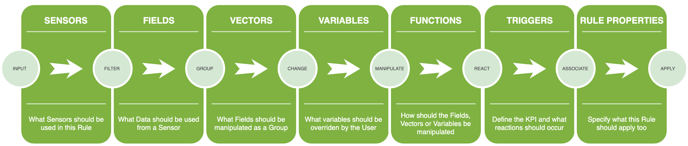
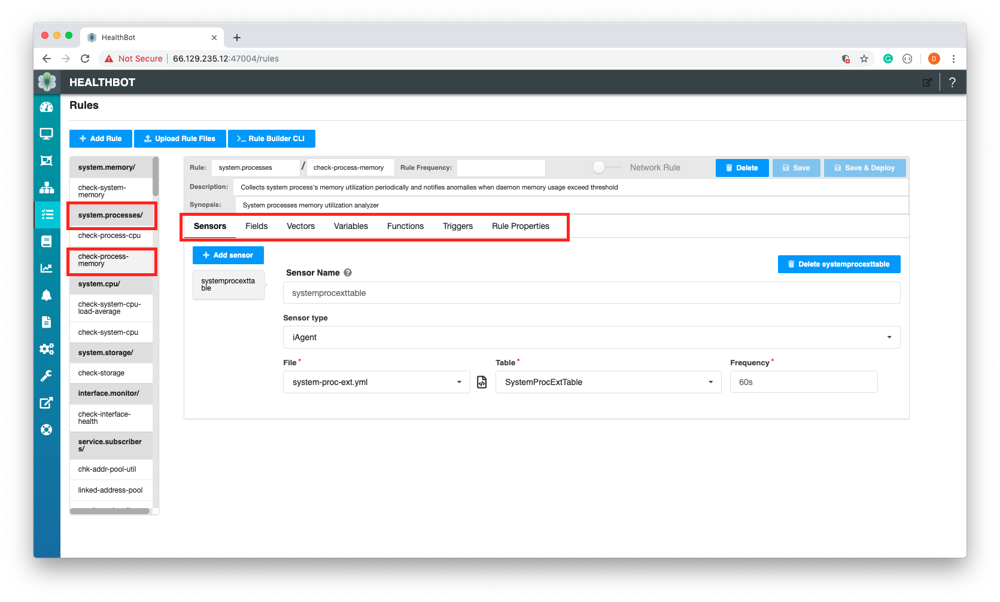
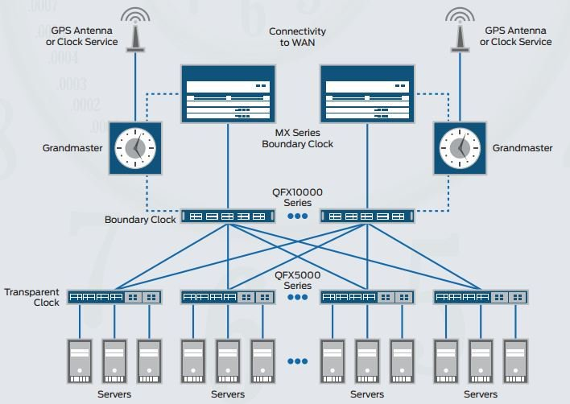
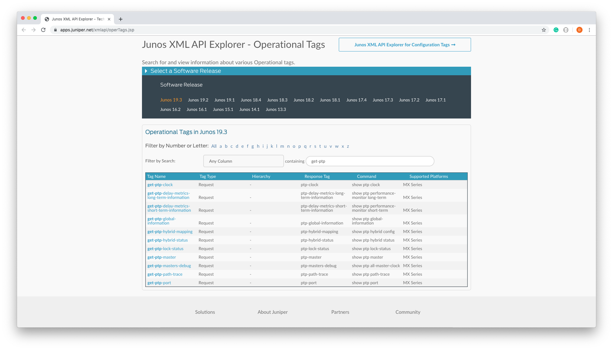
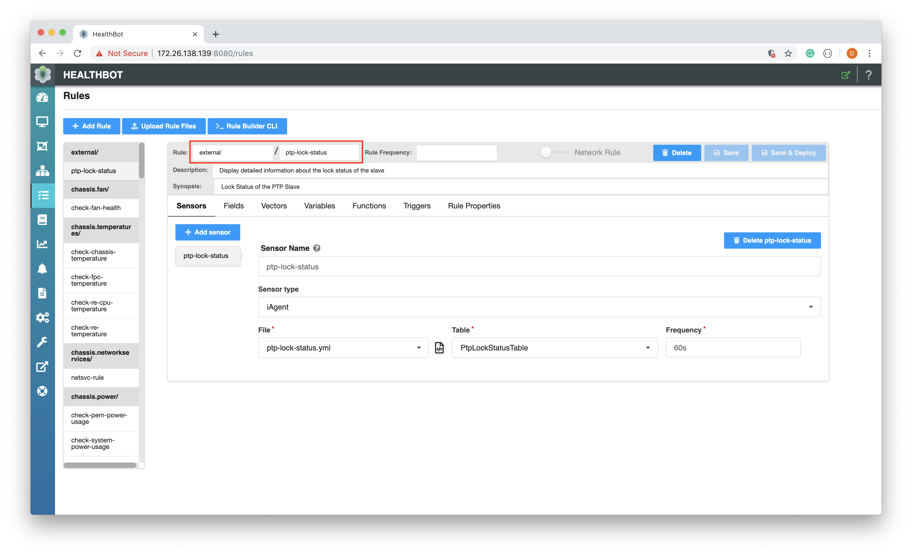
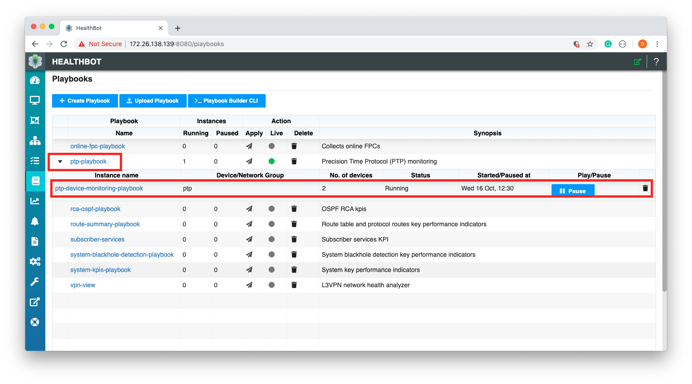
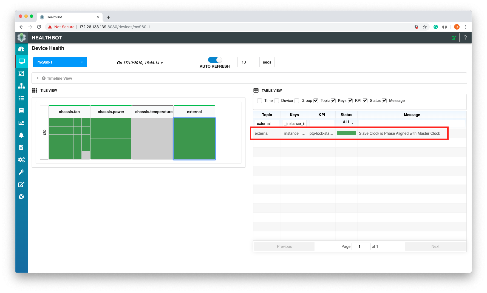

Once Devices are registered within Healthbot and assigned to one or more Device Groups, the remaining part of the configuration stage is to instantiate one or more Playbooks against the set of Device Groups. If you have worked through the [Quickstart](quickstart) Guide, you will remember that Playbooks are a key abstraction within Healthbot, through Rules they provide a language for describing KPIs and how-to react to them.

So to better understand Playbooks, we first need to understand Rules.

## Rules

Healthbot is primarily about capturing and reacting to Telemetry data, defining how-to capture and what way to react is the role of a [Rule](glossary#rule).

Therefore, when defining a Rule we need a language that describes what a Rule is and does, where to receive data from, a way to filter or manipulate the data and then a way to react to this data meaningfully. In software terms, this type of language is called a **Domain Specific Language** (DSL), i.e. a language that is specific to one domain, in our case Healthbot Telemetry.



Healthbot is shipped with a set of default Rules, available on Github at the [healthbot-rules](https://github.com/Juniper/healthbot-rules) repository. An example from this website shows an instance of the DSL targeted at defining a KPI for Temperature fluctuations within a Chassis [chassis-temperature.rule](https://raw.githubusercontent.com/Juniper/healthbot-rules/master/juniper_official/Chassis/chassis-temperature.rule), note the DSL instance definition ends with an extension **.rule** and follows a clear structure for the concepts described above.

The default set of Rules can be extended either through loading [community supplied](https://github.com/Juniper/healthbot-rules/tree/master/community_supplied) Rules or by creating your own Rules, this guide will predominantly be concerned with the latter.

### Dashboard

Rules can be created, updated and deleted through the Dashboard, there is a dedicated screen specifically for manipulating Rules.



This screen provides a visual representation and editor of the Rules DSL. In this example, we can see for the [Topic](glossary#topic) **system.processes**, there is a rule called **check-process-memory**, which analyses the system processes memory utilization on a Device. You can also see the **components** available within the DSL for defining a Rule.

Rather than using the Dashboard to define a Rule, we will use the Rule Builder CLI to construct our sample Rule.

#### Rule Builder CLI

The Rule Builder CLI is an extension to the Junos System Management Daemon (mgd).

The management daemon (mgd) provides a mechanism to process information for both network operators (CLI) and daemons (programmatically).

The interactive component of mgd is the Junos cli; this is a terminal-based application that allows the network operator an interface into Junos. The other side of mgd is the extensible markup language (XML) remote procedure call (RPC) interface; this provides an API through Junoscript and NETCONF to allow for the development of automation applications.

To access the cli (can also be done on the Web User Interface Rules Page) we will use ssh forwarding to the Healthbot server and connect to the cli through the mgd container running in Healthbot.

> ssh-copy-id installs an SSH key on a server as an authorized key. Its purpose is to provision access without requiring a password for each login. This facilitates automated, passwordless logins and single sign-on using the SSH protocol.

> DOCKER_HOST defines the Docker Daemon socket to connect to, in this case the Docker Daemon is connected to over the SSH Port. This requires Docker 18.09+

```sh
$ ssh-copy-id jcluser@66.129.235.13 -p 43001 # optionally use a different port for SSH if required
$ DOCKER_HOST=ssh://jcluser@66.129.235.13:43001 sh -c 'docker exec -it healthbot_mgd_1 cli' # note the use of the non-default SSH port
```

Note in my example the use of a non root user (**jcluser**), Healthbot Server (**66.129.235.13**) and a non default SSH port (**43001**) as well as using **healthbot_mgd_1** as the name of the mgd container running on the Healthbot Server.

This will drop you into the cli, which can be confirmed by typing ?

```sh
root@ce2568758089> ?
Possible completions:
  clear                Clear information in the system
  configure            Manipulate software configuration information
  monitor              Show real-time debugging information
  op                   Invoke an operation script
  quit                 Exit the management session
  request              Make system-level requests
  set                  Set CLI properties, date/time, craft interface message
  show                 Show system information
  start                Start shell
root@ce2568758089>
```

From here we can create, read, update and delete Healthbot configuration to do this we first need to load the Healthbot configuration into mgd.

```sh
root@ce2568758089> request iceberg load
Getting "retention-policy" hierarchy configuration
Done
Getting "notification" hierarchy configuration
Done
Getting "device" hierarchy configuration
Done
Getting "topic" hierarchy configuration
Done
Getting "playbook" hierarchy configuration
Done
Getting "device-group" hierarchy configuration
Done
Getting "network-group" hierarchy configuration
Done
Getting "system-settings" hierarchy configuration
Done

Configuration load complete
```

We can confirm that the load worked correctly by querying one of the configuration hierarchies for e.g.

```sh
root@ce2568758089> show configuration iceberg topic chassis.temperatures rule check-chassis-temperature sensor components
synopsis "Chassis components sensor definition";
description "/components open-config sensor to collect telemetry data from network device";
open-config {
    sensor-name /components/;
    frequency 60s;
}
```

This shows that we can see the configuration for the OpenConfig sensor **components**, that exist in **check-chassis-temperature**, which is a System Rule in the Topic **chassis.temperatures**.

Before we look at the Rule components, let's discuss the use case that we will author a Playbook and Ruleset against.

### Time Management

Increase in bandwidth requirements on wireless backhaul networks and the need to reduce costs and to improve flexibility have triggered the need for a packet-based backhaul infrastructure.

Traditional metro deployments do not cater to the delivery of synchronization services, and this leaves operators with no other choice than to keep older parallel infrastructure. Physical layer–based Synchronous Ethernet and packet-based Precision Time Protocol (PTP) enable routers and switches to deliver synchronization services that meet the requirements of today’s mobile network, as well as Long Term Evolution (LTE)–based infrastructures.



PTP, also known as IEEE 1588v2, is a packet-based technology that enables the operator to deliver synchronization services on packet-based mobile backhaul networks. IEEE 1588 PTP (Version 2) clock synchronization standard is a highly precise protocol for time synchronization that synchronizes clocks in a distributed system. The time synchronization is achieved through packets that are transmitted and received in a session between a master clock and a slave clock.

The system clocks can be categorized based on the role of the node in the network. They are broadly categorized into ordinary clocks and boundary clocks. The master clock and the slave clock are known as ordinary clocks. The boundary clock can operate as either a master clock or a slave clock. The following list explains these clocks in detail:

- Master clock—The master clock transmits the messages to the PTP clients (also called slave node or boundary node). This allows the clients to establish their relative time distance and offset from the master clock (which is the reference point) for phase synchronization. Delivery mechanism to the clients is either unicast or multicast packets over Ethernet or UDP.
- Slave clock—Located in the PTP client (also called slave or slave node), the slave clock performs clock and time recovery operations based on the received and requested timestamps from the master clock.
- Boundary clock—The boundary clock operates as a combination of the master and slave clocks. The boundary clock endpoint acts as a slave clock to the master clock, and also acts as the master to all the slaves reporting to the boundary endpoint.

For this guide we will monitor and act on the **Lock Status**, additional useful metrics are described below:

- [Lock Status](https://www.juniper.net/documentation/en_US/junos/topics/reference/command-summary/show-ptp-lock-status.html) - shows the lock status of a slave in a PTP network
- [Clock Class](https://www.juniper.net/documentation/en_US/junos/topics/reference/configuration-statement/clock-class-edit-protocols-ptp.html) - ESMC quality level
- [Phase Offset](https://www.juniper.net/documentation/en_US/junos/topics/reference/command-summary/show-ptp-lock-status.html) - offset information of a slave clock with respect to its master clock

For further information on PTP see [Configuring Precision Time Protocols](https://www.juniper.net/documentation/en_US/junos/topics/concept/ptp-overview.html).

### Components that make up a Rule

In this section, we will look at a subset of the components that make up a Rule, specifically Sensors, Fields and Triggers. We will see how these components interact with each other to define the Rule. Rule definition begins with identifying and describing the source of Telemetry that will 'feed' this rule, this is described in the Sensors component.

#### Sensors

As can be seen from the **show configuration** on the Sensor above, Sensors are defined by;

- Sensor Name
- Sensor Type; OpenConfig, Native GBP, iAgent (NETCONF) or SNMP
- Frequency

Depending on the Type selected, additional configuration will be required to complete the Sensor definition. For E.g. if OpenConfig is selected a sub-path (sensor-name) can be used to select content relevant to this Rule.

For our use case, the information that we are interested in is available over the NETCONF interface, so we will use the iAgent Ingest in Healthbot to retrieve the Sensor information.

iAgent (Ingest Agent) uses [PyEZ](https://www.juniper.net/documentation/en_US/junos-pyez/information-products/pathway-pages/junos-pyez-developer-guide.html) (Python Microframework) to collect data from Junos Devices. Therefore, we will need to define NETCONF collection criteria to PyEZ for the PTP Attributes that we are interested in. This is done by using the [PyEZ Table and Views](https://www.juniper.net/documentation/en_US/junos-pyez/topics/concept/junos-pyez-tables-and-views-overview.html) concepts.

> If you plan to create your own rules and use iAgent, it is strongly recommended that you read and work through the [PyEZ Developer Guide](https://www.juniper.net/documentation/en_US/junos-pyez/information-products/pathway-pages/junos-pyez-developer-guide.html).

Junos PyEZ Tables and Views enable you to extract operational information and configuration data from devices running Junos OS as well as configure devices running Junos OS. To extract information, you use predefined or custom Tables and Views to map command output or configuration data to a table, which consists of a collection of items that can then be examined as a View.

Once we have identified an Operational Command that gives us the information that we need e.g.

```console
user@host> show ptp lock-status
Lock Status:

Lock State    : 5 (PHASE ALIGNED)
Phase offset  : -0.000000013 sec

user@host>
```

We can use the [Junos XML API Explorer](https://apps.juniper.net/xmlapi/operTags.jsp) to determine how to collect this information from an API.

All operational commands that have Junos XML counterparts are listed in the [Junos XML API Explorer](https://apps.juniper.net/xmlapi/operTags.jsp). We will use the Junos XML API Explorer to determine what commands are available. Searching on the criteria **get-ptp** returns a number of commands e.g. **get-ptp-lock-status**.



This is useful if you don't know where in the Junos CLI hierarchy the information is, in our case we had identified an operational command to use **show ptp lock-status** and therefore the solution below is more suitable.

You can also display the Junos XML request tag element for any operational mode command that has a Junos XML counterpart on the CLI. To display the Junos XML request tag for a command in the CLI, include the **| display xml rpc** option after the command.

```console
user@host> show ptp lock-status | display xml rpc
<rpc-reply xmlns:Junos="http://xml.juniper.net/Junos/19.3R0/Junos">
    <rpc>
        <get-ptp-lock-status>
        </get-ptp-lock-status>
    </rpc>
    <cli>
        <banner></banner>
    </cli>
</rpc-reply>

user@host>
```

Therefore, by sending an XML RPC command to a Junos Device as follows we will get back the information required on the lock status.

```xml
<rpc><get-ptp-lock-status></get-ptp-lock-status></rpc>
```

As discussed iAgent uses PyEZ so we will create a PyEZ Table and View definition to send and correlate the response of the RPC request above. In Junos PyEZ, you define inline Tables and Views in YAML as a multi line strings in your module. For example the file **ptp-lock-status.yml** would look like:

```yaml
PtpLockStatusTable:
  rpc: get-ptp-lock-status
  item: .
  key: ptp-spll-lock-state
  view: PtpLockStatusView

PtpLockStatusView:
  fields:
    lockState: ptp-spll-lock-state
```

There are a few unusual components to this definition, since the response to **get-ptp-lock-status** is relatively flat (no arrays or nested structures) the use of the Tables item and key fields needs to be tailored specifically, note item **.** which indicates that we are retrieving information from the top-level structure and that the key is set explicitly to **ptp-spll-lock-state** later versions of Healthbot will introduce a **Null** concept for this scenario.

To use this configuration we need to upload this file (**ptp-lock-status.yml**) to our Healthbot Server. We have three options for doing this:

- On the Rules page, within the Graphical User Interface, using the **Upload Rules File** button at the top of the page.
- Copying the file directly to the location on the server where these files are stored **/var/local/healthbot/input/**
- By using the Postman Collection (Helper Files->Upload a Helper File) described in [REST APIs](rest-api#healthbot-collection) to upload this helper file.

Once the file has been uploaded to the Healthbot Server, we can confirm this by printing its contents to standard out.

```console
[user@healthbothost rules]# cat /var/local/healthbot/rules/community_supplied/Protocols/Ptp/ptp-lock-status.yml
PtpLockStatusTable:
  rpc: get-ptp-lock-status
  item: .
  key: ptp-spll-lock-state
  view: PtpLockStatusView

PtpLockStatusView:
  fields:
    lockState: ptp-spll-lock-state
```

We can now use this configuration to define a Sensor within a Rule. As described [above](playbooks-rules#rule-builder-cli), we will use the Rule Builder CLI to create our definition.

Once connected to the Rules Builder CLI via the DOCKER_HOST shell exec command above, we need to load the Healthbot configuration into mgd.

```console
root@db2d47fcc0ea> request iceberg load
Getting "retention-policy" hierarchy configuration
Done
Getting "notification" hierarchy configuration
Done
...
```

Next we need to edit the mgd candidate configuration

```console
root@db2d47fcc0ea> edit
Entering configuration mode

[edit]
root@db2d47fcc0ea#
```

At this point we can create any of the Healthbot abstractions; Device, Device Groups, Rules, Playbooks, etc. We will begin by creating a Rule for our PTP Lock Status use case.

```console
set iceberg topic external rule ptp-lock-status description "Display detailed information about the lock status of the slave" synopsis "Lock Status of the PTP Slave"
```

Finally, once we have a complete configuration, we can save this and exit the edit.

```console
[edit]
root@db2d47fcc0ea# commit and-quit
commit complete
Exiting configuration mode
```

Committing the configuration into mgd database does not store our configuration in Healthbot.
We need to run the following command to deploy the configuration into healthbot.

```console
root@db2d47fcc0ea> request iceberg deploy
Received configuration from mgd ...
Following python files are used in the configuration
system-sensors.py, mean-pool-utilization.py, traffic_diff.py, used-percentage.py, mplslabel.py, system-processes.py, micro_milli.py
Please make sure python files are copied under /var/local/healthbot/input directory, otherwise deploy will fail
Do you want to continue (y/n) ? y
Following iagent files are used in the configuration
pci-error.yml, software-version.yml, chassis-fan.yml, fpc_memory.yml, jnh-ifd-stream.yml, cm-error.yml, traffic-statistics.yml, sync-ospf-fpc.yml, task-io.yml, system-virtual-memory.yml, re-cpu-utilization.yml, system-proc-ext.yml, ospf-neighbor.yml, online_fpc.yml, system-queues.yml, host-loopback-status.yml, system-statistics-ip.yml, jnhexceptionpkt.yml, ddos-statistics.yml, chip.yml, rsvpsession.yml, ptp-lock-status.yml, route-protocol-summary.yml, netsvc.yml, pfe-ddos-policer.yml, fib.yml, ithrottle.yml, pre-classifier.yml, fpc_link_stats.yml, route-summary.yml, icmp_statistics.yml, jnh-exceptions.yml, system-storage-capacity.yml, pfe-traffic-statistics.yml, toe-pfe.yml, task-memory.yml, ospf.yml, system-storage.yml, linecard-ethernet-statistics.yml, fpc-threads.yml, system-cpu.yml, chassis-power.yml, ospf-kernel-route.yml, fpc-utilization.yml, scheduler-info.yml
Please make sure the user defined iagent files are copied under /var/local/healthbot/input directory, otherwise deploy will fail
Do you want to continue (y/n) ? y
Uploading "device" hierarchy configuration
Done
Uploading "topic" hierarchy configuration
Done
Uploading "playbook" hierarchy configuration
Done
...
Configuration deploy complete

root@db2d47fcc0ea>
```

At this point we have a Rule defined called ptp-lock-status, it exists in the external topic and it currently contains no configuration for any of the Rule Components: Sensors, Fields, Vectors, ...

Let's go ahead now and create a Sensor definition based on the PyEZ yaml configuration (**ptp-lock-status.yml**) we previously uploaded to the server. So begin by editing the candidate configuration.

```console
root@db2d47fcc0ea> edit
Entering configuration mode

[edit]
root@db2d47fcc0ea#
```

As before, let's use the set command to create a definition, this time for a sensor in the ptp-lock-status Rule.

```console
set iceberg topic external rule ptp-lock-status sensor ptp-lock-status description "An iAgent based Sensor, using the ptp-lock-status.yml configuration file" synopsis "iAgent PTP Sensor" iAgent file "ptp-lock-status.yml" table "PtpLockStatusTable" frequency 60s
```

As can be seen for above, the iAgent File, the Table defined within and the Frequency for how often iAgent will request this data from the Device are defined in the set command.

As before **commit and-exit** and push the configuration from mgd to Healthbot using **request iceberg deploy**.

At this point we have a valid Sensor definition, this can be verified by viewing the Rule on the Graphical User Interface.



#### Fields

Typically when a Sensor is defined, it contains more than one piece of data. Fields provides a solution to chery-picking the specific data that your interested in within the Sensor.

In our use case we need to define a Field to represent the lock status. This will expose the integer value for the NETCONF leaf ptp-spll-lock-state. We can do this as before using the Rule Builder CLI.

```console
set iceberg topic external rule ptp-lock-status field lock-status description "extract the ptp-spll-lock-state for processing" type integer sensor ptp-lock-status path "lockState"
```

We can see from the configuration command that we are defining a field lock-status, of type integer that will contain the value of the ptp lock state of the slave.

To persist and deploy the configuration **commit and-exit** and push the configuration from mgd to Healthbot using **request iceberg deploy**.

#### Triggers

Triggers define the system behavior of a Key Performance Indicator. Triggers include a mechanism for defining policies wrt how Healthbot should react when a KPI Threshold Crossing occurs. The syntax of a Trigger allows the user to define terms that can evaluate fields, functions, variables and on match (condition), indicate through color (action) a problem or clearing of a previous problem. As before, we will use the Rule Builder CLI to configure our trigger.

```console
set iceberg topic external rule ptp-lock-status trigger ptp-lock-status synopsis "Alert if Slave Clock is not Phase Aligned" description "Indicate as Red if the Slave Clock status is Free-run, Initialized, Acquiring or Freq locked"
```

Once the Trigger is defined, we need to create terms to represent the KPI Threshold Crossing behavior.

```console
set iceberg topic external rule ptp-lock-status trigger ptp-lock-status term is-lock-status-valid when equal-to $lock-status 5
set iceberg topic external rule ptp-lock-status trigger ptp-lock-status term is-lock-status-valid then status color green
```

And for the invalid condition

```console
set iceberg topic external rule ptp-lock-status trigger ptp-lock-status term is-lock-status-invalid when not-equal-to $lock-status 5
set iceberg topic external rule ptp-lock-status trigger ptp-lock-status term is-lock-status-invalid then status color red
```

From above, you can see that terms are created for valid and invalid lock status, conditions evaluating on the state value of 5 (Phase Aligned) and actions resulting in the colors either going green (valid) or red (invalid).

## Playbooks

Finally, now that we have defined a Rule, we can associate that Rule with a Playbook. Our Playbook will include a reference to the PTP Rule we created and can therefore be assigned to a Device Group that is interested in PTP monitoring.

```console
set iceberg playbook ptp-playbook synopsis "Precision Time Protocol (PTP) monitoring" description "Precision Time Protocol (PTP) enable routers and switches to deliver synchronization services" rules external/ptp-lock-status
```

As you can see, we have created the Playbook **ptp-playbook** and associated our Rule **ptp-lock-status** in the **external** Topic with it.



To confirm our configuration, we can create an instance of the Playbook in the Graphical User Interface and associate it with a Device Group.



In the screenshot above you can see the ptp Device Group, for Topic external, KPI ptp-lock-status is showing that the Slave Clock is Phase Aligned with the Master for the Device mx960-1.
