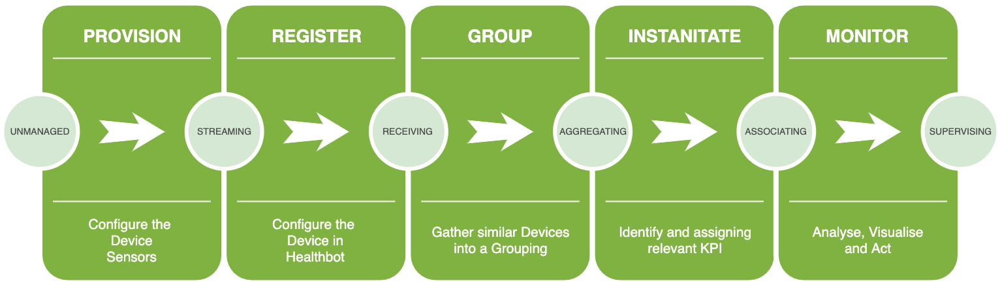

This document assumes you have installed Healthbot and have access to the Dashboard at [https://<your-server>/](https://<your-server>/).

This guide will walk you through the minimum amount required to get Healthbot managing one of your Devices.

The process required to do this is as follows:

## Provision

The initial task is to **configure your Device sensors** to generate Telemetry towards Healthbot. There are a number of ways that Healtbot can recieve Telemtry (Openconfig, JTI Native Sensor, NETCONF or SNMP) this guide will focus on Openconfig.

## Register

Once a Device is provisoned for Telemetry, we can incorporate that Device by **configuring its management ip and authentication details within Healthbot**.

## Group

When one or more Devices are available within Healthbot we can **group them using a classifier** that is relevant to our network. For e.g. we could defines groups for Customer Equipment or Provider Equipment, or we could group on region, ownership or any other criteria relevant to our organisation.

Why do we want to group Devices? Within Healthbot Playbooks are instanitated against Device Groupings (or Network Groupings).

## Instanitate

Interally Healthbot uses concepts such as Topics, Rules and Playbooks to define and categorise Key Performance Indicators for different Networks or functions and hows the system should react in the event of an incident. In this stage we will map the KPIs that we are interested in, against the Device Grouping we created in the previous stage.

## Monitor

Finally we confirm that the solution has been configured correctly by viewing the Device Group / Device Monitor screen and identifying any issues that require a resolution.
