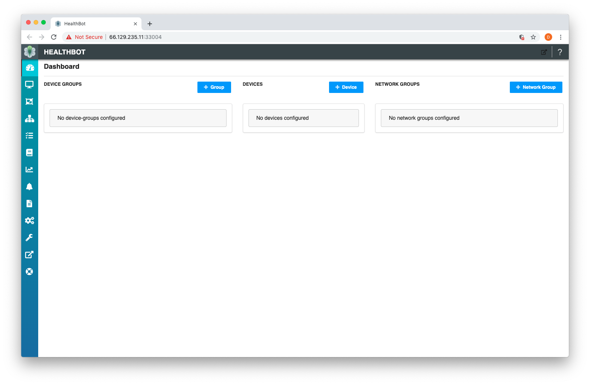
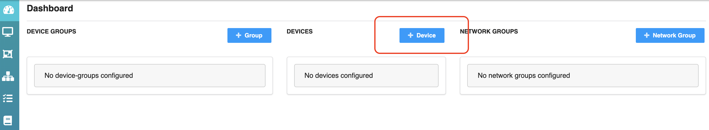
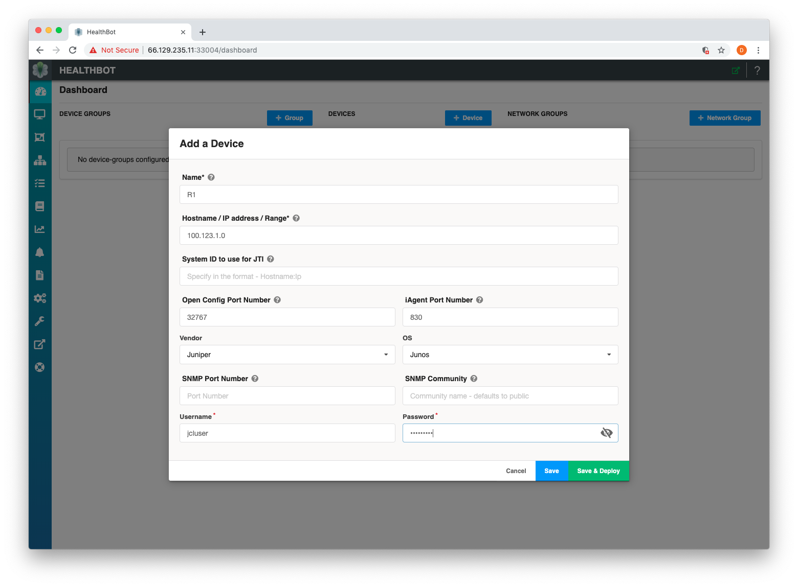
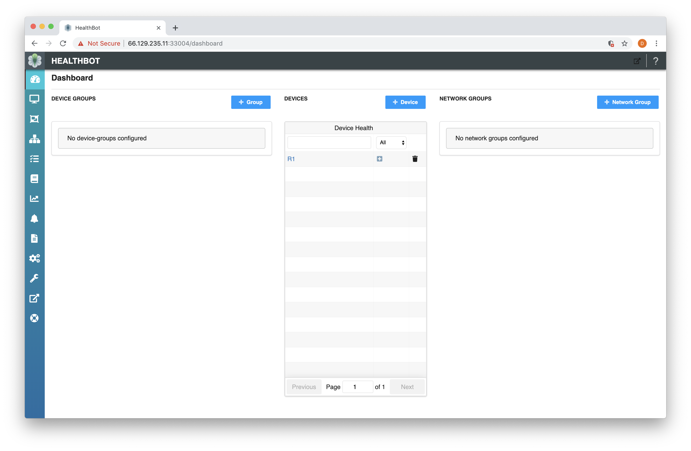
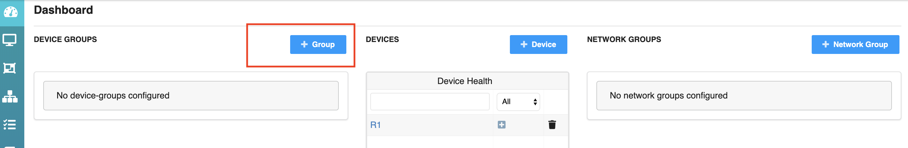
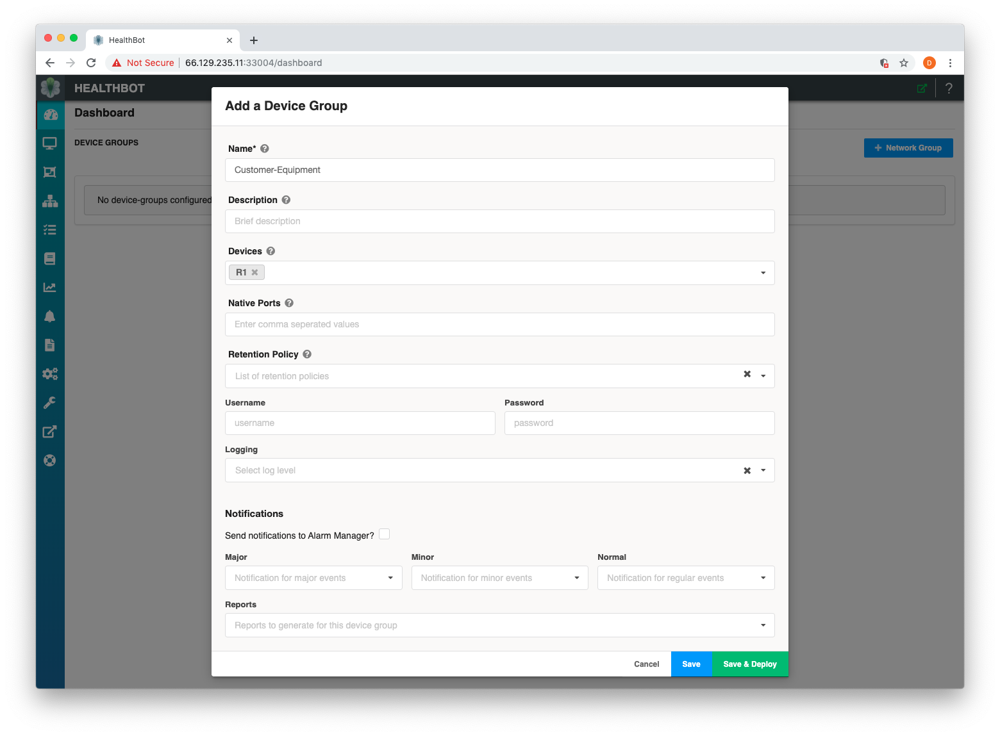
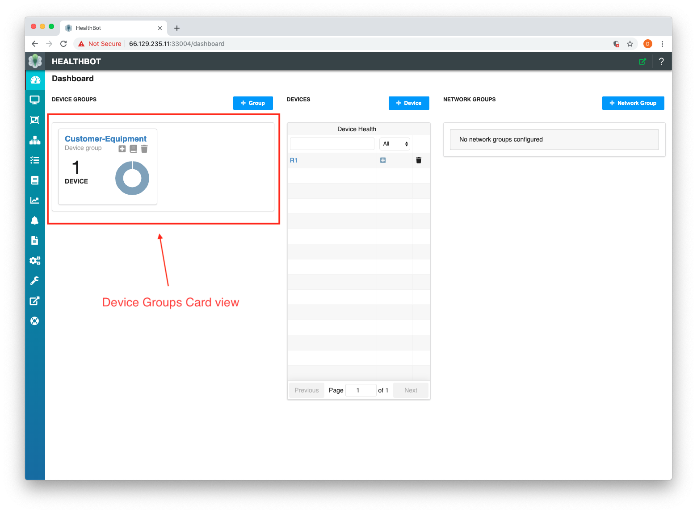

This guide assumes you have installed Healthbot and can access the Dashboard as below.



This guide will walk you through the minimum amount required to get Healthbot monitoring one of your Devices.

The process required to do this is as follows:


There are a number of steps required to go from a blank system to a monitoring Devices.

1. Provisioning the Device
2. Registering the Device within Healthbot
3. Grouping Devices based on a business classifer
4. Instanatiating a Playbooks against Device Groups
5. Monitoring the KPIs within your network and reacting based on Network incidents

Each of these steps are defined below;

## Provision

The initial task is to **configure your Device sensors** to generate Telemetry towards Healthbot. There are a number of ways that Healtbot can recieve Telemtry (Openconfig, JTI Native Sensor, NETCONF or SNMP) this guide will focus on Openconfig.

This document describes the process for enabling [OpenConfig on a JUNOS Device](https://www.juniper.net/documentation/en_US/junos/topics/task/installation/openconfig-installing.html).

> Implementing OpenConfig with gRPC for Junos Telemetry Interface requires that you download and install a package called Network Agent if your Juniper Networks device is running a version of Junos OS with Upgraded FreeBSD. For all other versions of Junos OS, the Network Agent functionality is embedded in the software. Versions of JUNOS prior to 18.3R1 may require the OpenConfig and Network Agent packages installed.

After logging into the cli, the Device must be configured for gRPC as follows:

```
[edit system services]
user@host# set extension-service request-response grpc clear-text address 0.0.0.0
```

Additional information can be found in the [configuring gRPC topic](https://www.juniper.net/documentation/en_US/junos/topics/task/configuration/grpc-junos-telemetry-interface-configuring.html).

## Register

Once a Device is provisoned for Telemetry, we can incorporate that Device by **configuring its management ip and authentication details within Healthbot**.

To register a Device within Healthbot, navigate to the Dashboard page and select **+ Device** button.



This will open a pop-up window as below. At this point you need to provide the following information about your Device:

```
Device Name: R1
Device Ip Address: 100.123.1.0
Username: jcluser
Password: *****
```

Assuming your Device is a JUNOS Device, the remaining information can be left as default.



At this point go ahead and select **Save and Deploy**. Assuming everyting worked ok you should now see a screen as follows:



Note in the **Devices Card View** you can see a single entry for the Device you registered, in my case **Device R1**.

## Group

When one or more Devices are available within Healthbot we can **group them using a classifier** that is relevant to our network. For e.g. we could defines groups for Customer Equipment or Provider Equipment, or we could group on region, ownership or any other criteria relevant to our organisation.

Why do we want to group Devices? Within Healthbot, Playbooks are instanitated against Device Groupings (or Network Groupings).

To classify one or more Devices within Healthbot, navigate to the Dashboard page and select **+ Group** button.



This will open a pop-up window as below. At this point you need to provide the following information about your Device Group:

```
Device Group Name: Customer-Equipment
Devices: R1
```

Assuming your Device is a JUNOS Device, the remaining information can be left as default.



At this point go ahead and select **Save and Deploy**. Assuming everyting worked ok you should now see a screen as follows:



## Instanitate

Interally Healthbot uses concepts such as Topics, Rules and Playbooks to define and categorise Key Performance Indicators for different Networks or functions and hows the system should react in the event of an incident. In this stage we will map the KPIs that we are interested in, against the Device Grouping we created in the previous stage.

## Monitor

Finally we confirm that the solution has been configured correctly by viewing the Device Group / Device Monitor screen and identifying any issues that require a resolution.
