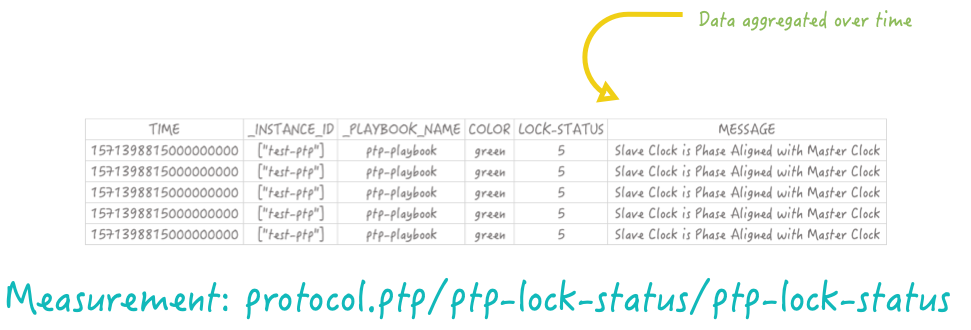
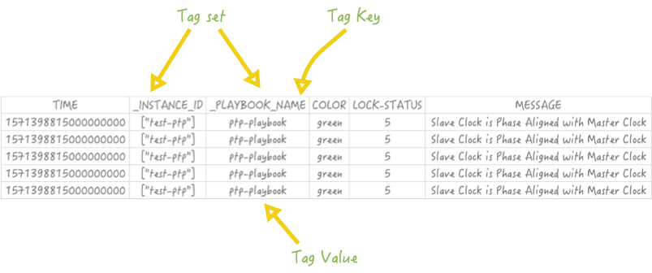

This guide describes what a Time Series Database (TSDB) is, the solution adopted by Healthbot and demonstrates a few tools for interacting directly with the TSDB running in your Healthbot deployment.

> The initial overview material in the section below, was tailored from this [web article](https://devconnected.com/the-definitive-guide-to-influxdb-in-2019/).

## Time Series Databases

Time Series Databases, as their name state, are database systems specifically designed to handle time-related data.

Most people will be familiar with relational database such as MySQL or Postgres, these systems are based on the fact that they are modeled using tables. These tables contain columns and rows, each one of them defining an entry in your table. Often, those tables are specifically designed for a purpose: one may be designed to store users, or maintain Device information. Such systems are efficient, scalable and used by companies worldwide for million of requests on their servers.

Time series databases work differently. Data is still stored in ‘collections’ but these collections share a common denominator: they are aggregated over time. Essentially, it means that for every point that you are able to store, you have a timestamp associated with it.

But couldn’t we use a relational database and simply have a column named ‘time’? Oracle for example includes a TIMESTAMP data type that we could use for that purpose. You could, but that would be inefficient.

Time series databases systems are built around the predicate that they need to ingest data in a fast and efficient way.

Indeed, relational databases do have a fast ingestion rate for most of them, from 20k to 100k rows per second. However, the ingestion is not constant over time. Relational databases have one key aspect that make them slow when data tends to grow: indexes.

When you add new entries to your relational database, and if your table contains indexes, your database management system will repeatedly re-index your data for it to be accessed in a fast and efficient way. As a consequence, the performance of your DBMS tends to decrease over time. The load is also increasing over time, resulting in having difficulties reading your data.

Time series database are optimized for a fast ingestion rate. It means that such index systems are optimized to index data that is aggregated over time: as a consequence, the ingestion rate does not decrease over time and stays stable, around 50k to 100k lines per second on a single node.

## InfluxDB

[InfluxDB](https://github.com/influxdata/influxdb) is an open-source time series database (TSDB) developed by InfluxData. It is written in Go and optimized for fast, high-availability storage and retrieval of time series data in fields such as operations monitoring, application metrics, Internet of Things sensor data, and real-time analytics.

> Before starting, it is important for you to know which version of InfluxDB you are currently using. As of April 2019, InfluxDB comes in two versions : v1.7+ and v2.0. v2.0 is currently in alpha version and puts the Flux language as a centric element of the platform. v1.7 is equipped with InfluxQL language (and Flux if you activate it). As of 2.0.2 Healtbot is based on InfluxDB v1.x

Further information on the query language can be found at [Influx Query Language](https://docs.influxdata.com/influxdb/v1.7/query_language/)(IFQL).

In guide below, I shall show some sample IFQL queries, you can run these against your own Healthbot Server using the [InfluxDB Client](https://docs.influxdata.com/influxdb/v1.7/tools/shell/).

Connecting to the InfluxDB instance on your Healthbot server using the influx client can be done using Docker to connect to the influx container on Healthbot and running the influx cli tool, as below:

```sh
$ DOCKER_HOST=ssh://root@172.26.138.139 sh -c 'docker exec -it healthbot_influxdb_1 /bin/bash'
$ influx
Connected to http://localhost:8086 version 1.5.2
InfluxDB shell version: 1.5.2
>
```

### InfluxDB Key Concepts

In this section, we will go through the list of essential terms to know to deal with InfluxDB in 2019.

#### Database

A database is a fairly simple concept to understand on its own because you are used to using this term with relational databases. In a SQL environment, a database would host a collection of tables, and even schemas and would represent one instance on its own.

In InfluxDB, a database hosts a collection of measurements. However, a single InfluxDB instance can host multiple databases. This is a significant differentiation from traditional database systems.


The most common ways to interact with databases are either creating a database or by navigating (use) into a database in order to see collections (you have to be “in a database” in order to query collections, otherwise it won’t work). For e.g. we can navigate into database-1 as follows:

```sql
use ptp:mx960-1;
```

Healthbot will create lots of InfluxDB Databases. There will be internal databases used by the various Healthbot processes and there will be databases that represent the telemetry collected from the Device Group:Devices involved in running instances of Playbooks. We will focus this guide on understanding the latter.

#### Measurement

As shown in the diagram above, a database stores multiple measurements. You should think of a measurement as a SQL table. It stores data, and even metadata, over time. Data that is meant to coexist together should be stored in the same measurement.



An example IFQL query for this measurement would be:

```sql
select * from "protocol.ptp/ptp-lock-status/ptp-lock-status" limit 5;
```

> Note the use of inverted commas around the measurement name as the name includes the forward slash and dot characters.

In a SQL world, data is stored in columns, but in InfluxDB we have two other terms: tags & fields.

#### Tags & Fields

This is a very important topic as it explains the subtle difference between tags & fields.

When defining a new ‘column’ in InfluxDB, you have the choice to either declare it as a tag or as a field and it makes a very big difference.

In fact, the biggest difference between the two is that tags are indexed and fields are not. Tags can be seen as metadata defining our data in the measurement. They are hints giving additional information about data, but not data itself.

Fields, on the other hand, is literally data. In our past example, the temperature ‘column’ would be a field.

Back to our protocol.ptp/ptp-lock-status/ptp-lock-status example, let’s say that we wanted to add a column named ‘location’ as its name states, defines where the sensor is.

Should we add it as a tag or a field?


In this case, it would be added as a tag! We definitely want the location ‘column’ to be indexed and taken into account when performing a query over the location.

Now that we’ve added the location tag to our measurement, let’s go a bit deeper into the taxonomy.

A set of tags is called a “tag-set”. The ‘column name’ of a tag is called a “tag key”. Values of a tag are called “tag values”. The same taxonomy repeats for fields.



#### Timestamp

Probably the simplest keyword to define. A timestamp in InfluxDB is a date and a time defined in RFC3339 format. When using InfluxDB, it is very common to define your time column as a timestamp in Unix time expressed in nano seconds.

#### Retention policy

A retention policy defines how long you are going to keep your data. Retention policies are defined per database and of course you can have multiple of them. By default, the retention policy is ‘autogen‘ and will basically keep your data forever. In general, databases have multiple retention policies that are used for different purposes.


What is a typical use-case of retention policies?

If you are using InfluxDB for live monitoring of an entire infrastructure.

You want to be able to detect when a server goes off for example. In this case, you are interested in data coming from that server currently. You are not interested in keeping the data for several months, as a consequence you want to define a small retention policy: one or two hours for example.

#### Point

Finally, an easy one to end this chapter about InfluxDB terms. A point is simply a set of fields that has the same timestamp. In a SQL world, it would be seen as a row or as a unique entry in a table.

## InfluxDB in Healthbot

Now that we have a good understanding of how Telemetry is stored in Healthbot, lets look at how we can query this data.

...
